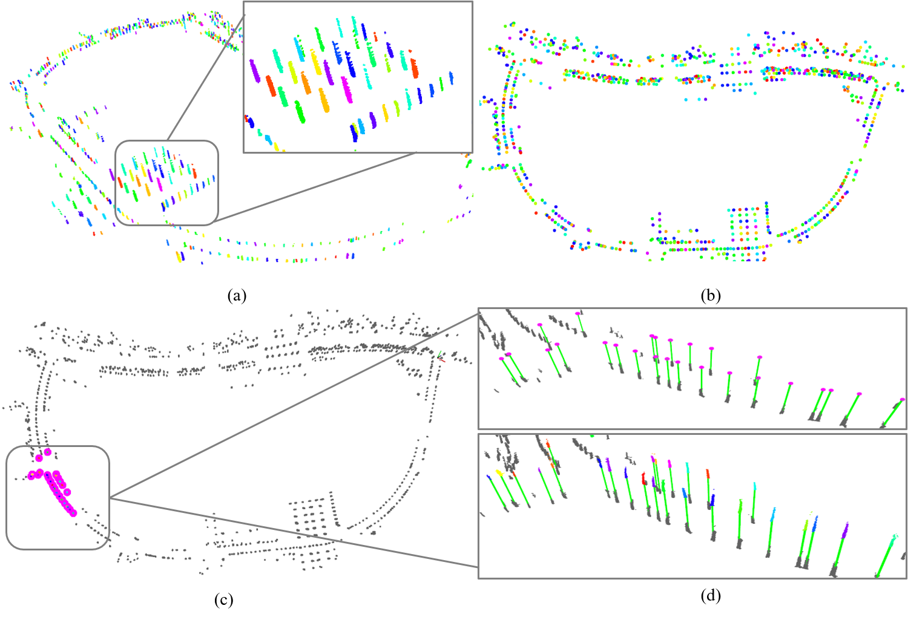

# Long Term Localization
Pole-like Objects Mapping and Long-Term Robot Localization is an algorithm that makes robot or UAV locate itself in Dynamic Urban Scenarios robustly and accurately by correcting the real time Lidar odometry.



If you use Long Term Localization, please cite:
```
Z. Wang, S. Li, M. Cao, H. Chen and Y. Liu, "Pole-like Objects Mapping and Long-Term Robot Localization in Dynamic Urban Scenarios," 2021 IEEE International Conference on Robotics and Biomimetics (ROBIO), 2021, pp. 998-1003, doi: 10.1109/ROBIO54168.2021.9739599.
```

# 0 Download Self-made Dataset
2020-10-12-demo.bag

https://drive.google.com/file/d/1cF6FoB6OEIBzl4U96_YxJtfJn8tEVwIr/view?usp=sharing

2020-11-05-demo.bag

https://drive.google.com/file/d/1GTiFdtKle1ydBWt5SqTHwGaCLaXfB3-3/view?usp=sharing

# 1 Settings
- System: ubuntu 16.04
- C++ version: c++17
- g++/gcc >= 7.0
    - [How to upgrade your g++ and gcc?](https://www.zybuluo.com/iStarLee/note/1260368)
- cmake >= 3.10
    - [upgrade your cmake](https://www.zybuluo.com/iStarLee/note/1739997)

# 2 Build

## 2.1 Install dependencies
Please take a look the [README](https://github.com/HITSZ-NRSL/long-term-localization/blob/master/src/common/README.md) in `long-term-localization/src/common` folder.
And the size of the model file is too big, the training process can refer to the range-net++ in "long-term-localization/src/other_pkgs/lidar-bonnetal/" folder.

## 2.2 build lio_sam
```
cd ~
mkdir -p lio_sam_ws/src
cd lio_sam_ws/src
git clone https://github.com/nixwang/lio_sam.git
cd ../
catkin_make
```

## 2.3 Build
```
cd ~
git clone https://github.com/HITSZ-NRSL/long-term-localization.git
cd long-term-localization/src
git clone https://github.com/lisilin013/third_parities.git

cd ..
# When you build this ws for the first time, it may take a long time, be patient please.
catkin build
```


# 3 Run

## 3.1 Semantic Processing
```bash
# terminal 1
cd ~/lio_sam_ws
roslaunch lio_sam run.launch 

# terminal 2
cd long-term-localization
./sh/record.sh

# terminal 3
rosbag play 2020-10-12-demo.bag --clock 
```
When the bag run over, shut down the terminal 2 and 3; 

Then run below code to extract the semantic.

pytorch version necessary:

pytorch==1.7.1 torchvision==0.8.2 torchaudio==0.7.2 cudatoolkit=10.1

The trained CNN model can be download here.
```
https://www.jianguoyun.com/p/DUoZpFUQ84SvCRjL2OsD (Access Password：nros2021)
```
or in google drive
```
https://drive.google.com/file/d/1d7nw5IuQdAzLGRM5W_cP4LZbxnh2_3lw/view?usp=sharing
```

and unzip the model file in "long-term-localization/src/other_pkgs/lidar-bonnetal", then run below sh file.

```bash
cd long-term-localization
./sh/offline_process.sh
```


## 3.2 Mapping
Modify the following code in config file `src/long_term_relocalization/config/long_term_relocalization_params.yaml`
change to `localizaion` mode.
```
relocalization:
  mode: localization
```

```
# play bag
cd ~/offline_process/sequences/00
rosbag play semantic.bag --clock

# launch mapping nodes.
roslaunch long_term_relocalization mapping.launch

# when you want to save pole cluster map, open another terminal and run the following cmd.
rosrun long_term_relocalization save_cluster_map 
```
The cluster_map will be saved in "\tmp\clusters_map.bin"


## 3.3 Localization


 - Notes: The bag to be matched (2020-11-05-demo.bag) need to run the process in **3.1 Semantic Processing** to extract the semantic cluster, and then used for matching and relocalization. 

### 3.3.1 Semantic Processing

```bash
# terminal 1
roslaunch lio_sam run.launch 

# terminal 2
./sh/record.sh

# terminal 3
rosbag play 2020-11-05-demo.bag --clock 
```
When the bag run over, shut down the terminal 2 and 3; 

Then run below code to extract the semantic.

```bash
./sh/offline_process.sh
```

### 3.3.2 Localization

Modify the following code in config file `src/long_term_relocalization/config/long_term_relocalization_params.yaml`
change to `relocalization` mode.
```
relocalization:
  mode: relocalization
```

```
# launch relocalization nodes.
roslaunch long_term_relocalization relocalization.launch
```

Then play the processed bag (by 2020-11-05-demo.bag) to match with "clusters_map.bin".

```
cd ~/offline_process/sequences/00
rosbag play semantic.bag --clock   
```


